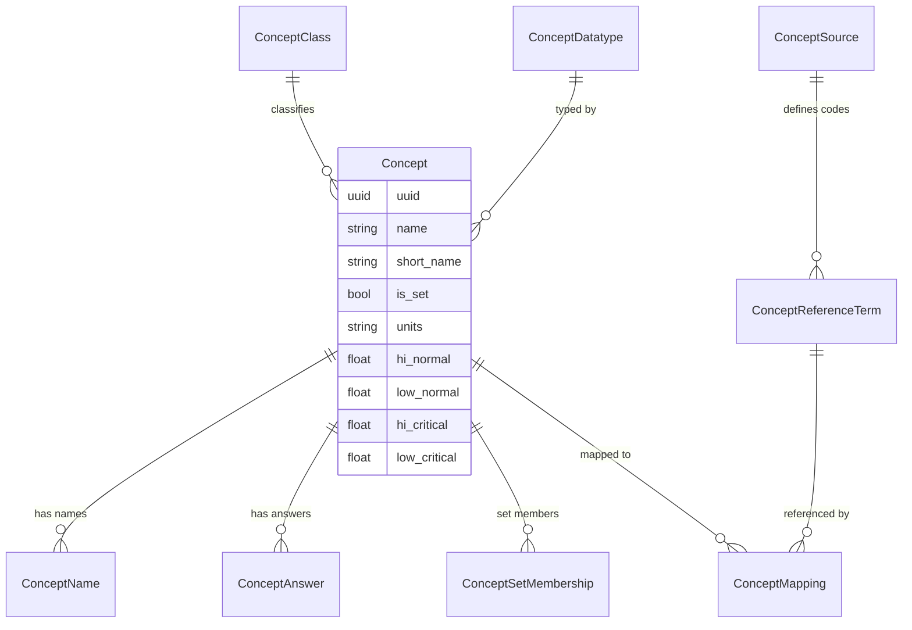
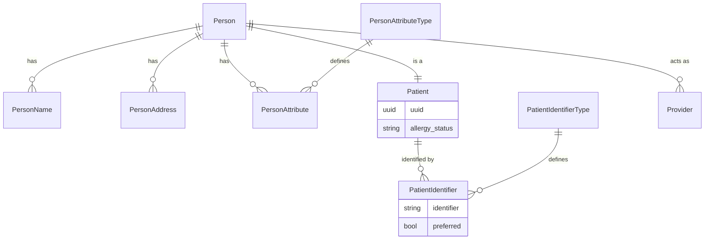
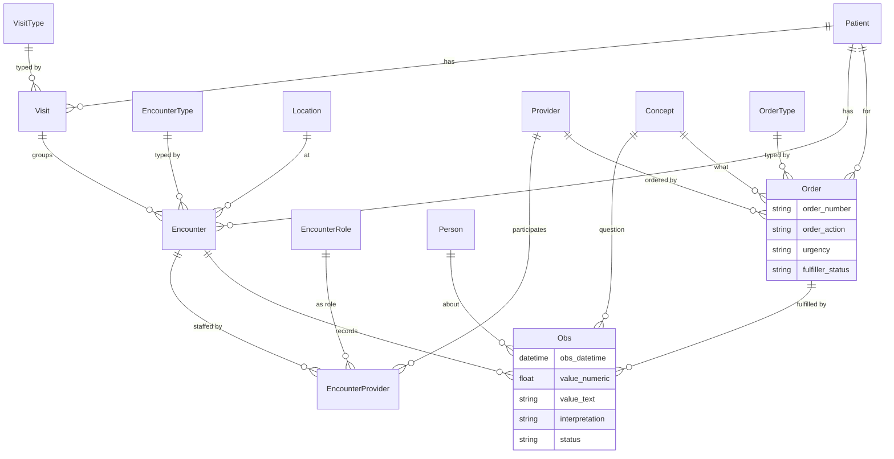
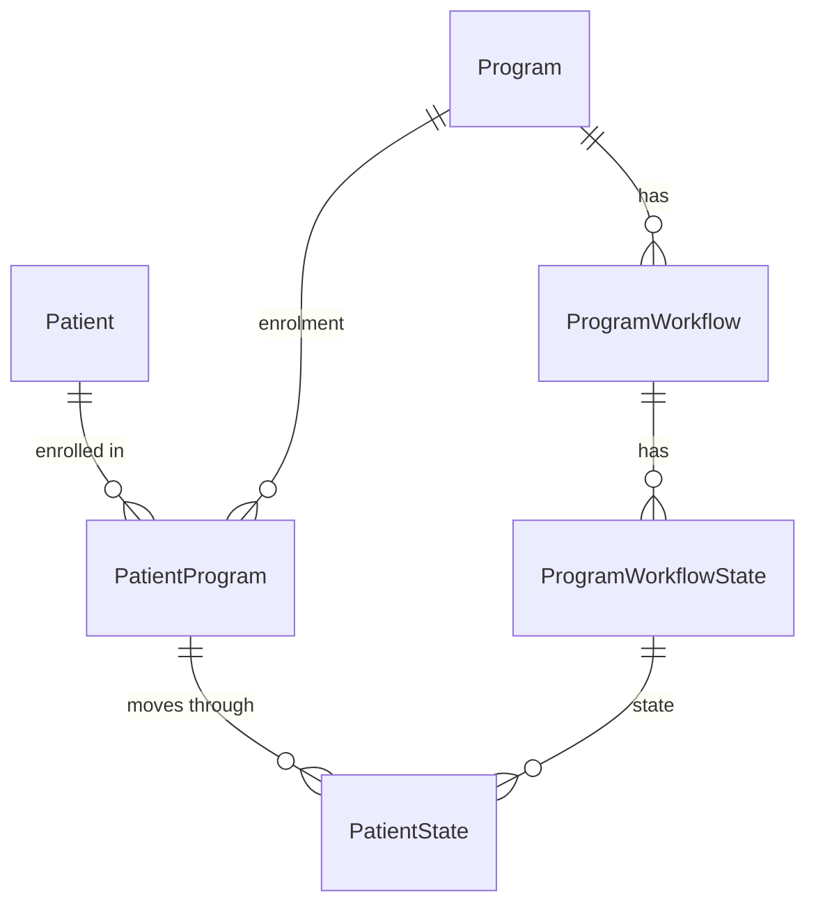
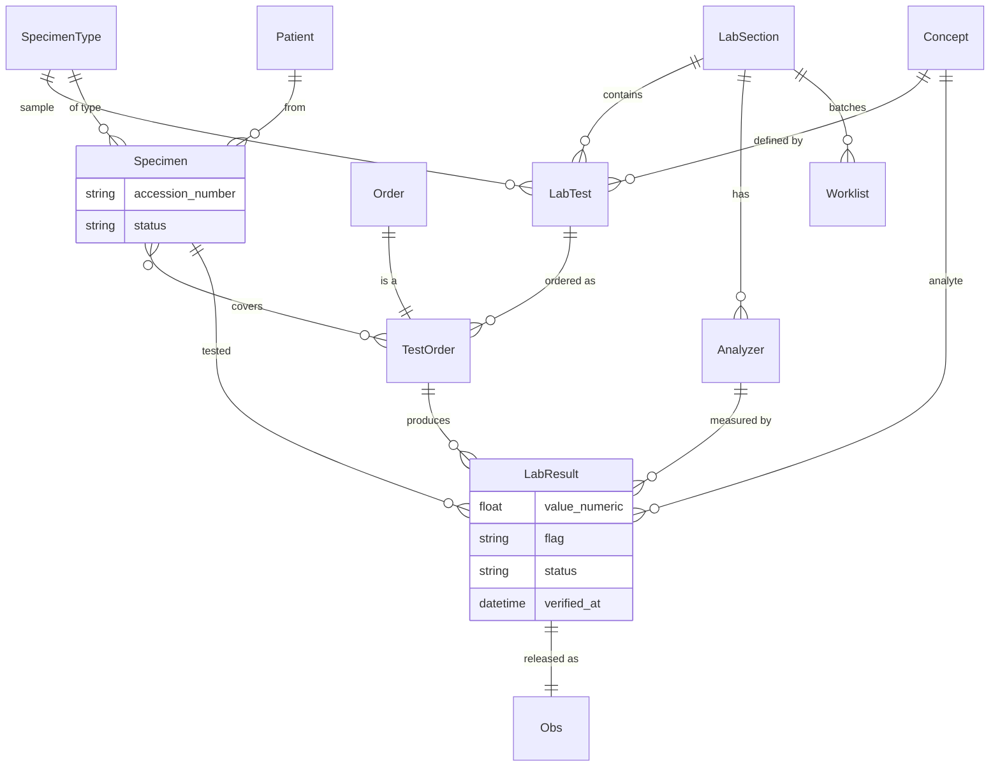
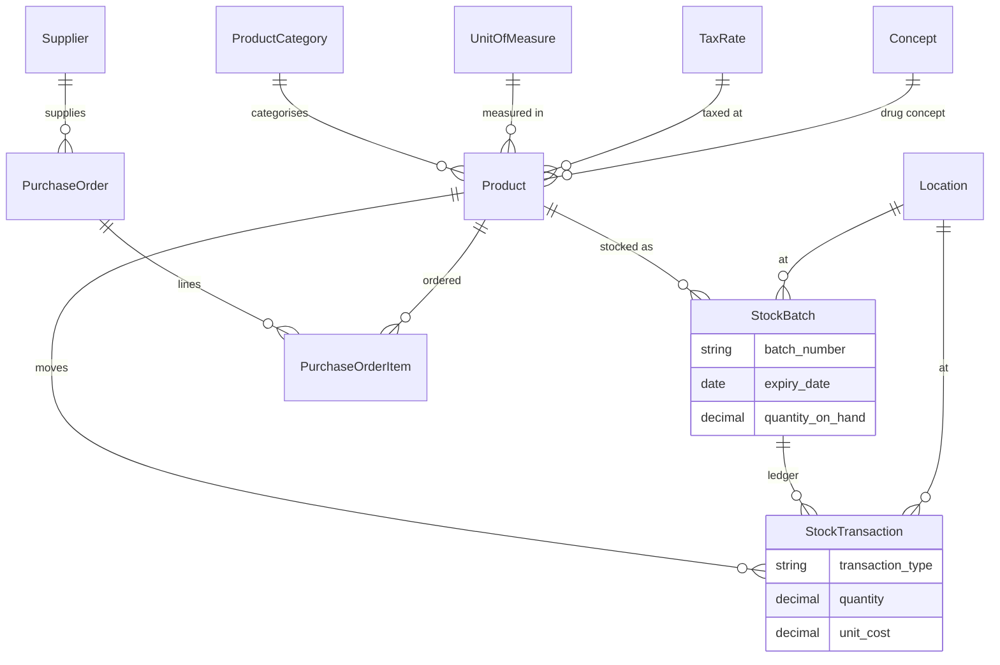
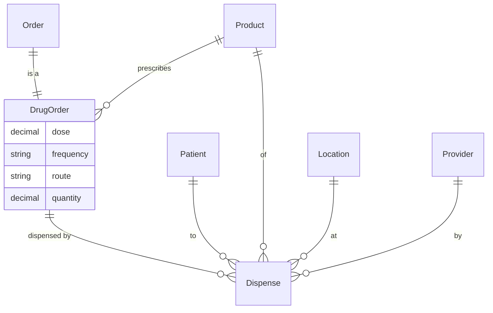
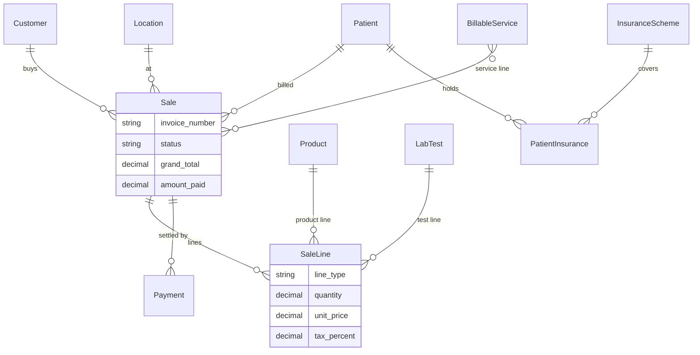

# Medraxis — Entity Relationship Diagrams

Mermaid ER diagrams per domain. The abstract OpenMRS base classes
(`BaseOpenmrsData`, `BaseOpenmrsMetadata`) contribute `uuid`, audit and
soft-delete columns to every entity and are omitted from the diagrams for
readability.

> Legend: `||--o{` = one-to-many, `||--||` = one-to-one, `}o--o{` = many-to-many.

---

## 1. Concept dictionary (semantic core)

## 2. Person / Patient (demographics & identity)

## 3. Clinical activity (visit / encounter / obs / order)

## 4. Programs (longitudinal care)

## 5. LIS / LIMS

## 6. Inventory & stock

## 7. Pharmacy

## 8. POS & billing

---

## Normalization note

The schema is designed to **3NF**. Deliberate denormalisations, each with a
clear maintenance strategy:

- `Sale.subtotal/tax_total/grand_total/amount_paid` — derived totals cached on
  the invoice header for fast listing/reporting; recomputed from lines via
  `Sale.recalculate()` and on every payment.
- `StockBatch.quantity_on_hand` — running balance maintained transactionally
  alongside the append-only `StockTransaction` ledger (the ledger is the source
  of truth and can fully reconstruct the balance).
- `Patient.allergy_status` — convenience flag for the chart banner.
