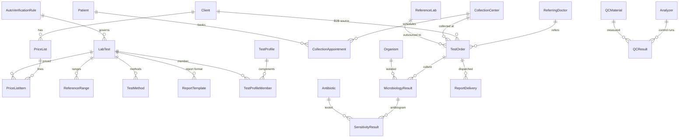

# FLabs — Reverse-Engineered System Design Research

> **Disclaimer.** FLabs (flabslis.com) is proprietary; its source code and exact
> schema are not public. This document is a **reverse-engineered analysis**
> inferred from its publicly described workflows and the standard architecture of
> modern diagnostic-lab (LIS/LIMS) platforms. It is used here purely as *feature
> inspiration* to decide what Medraxis must model — not a copy of FLabs.

The goal: extend the Medraxis LIS so the platform behaves as a complete
diagnostic-centre system, around the four pillars FLabs is known for:
**AI automations, machine (analyzer) interfacing, multi-branch management, and
WhatsApp/omni-channel report delivery.**

---

## 1. The diagnostic-lab business, as a system

A diagnostic centre is a B2B2C business, not just a clinical lab:

```
 Referrer / Source                Lab network                    Patient
 ─────────────────                ───────────                    ───────
 Walk-in patient        ┌──► Collection Center ──┐
 Referring doctor  ─────┤                         ├──► Processing Lab ──► Report
 B2B client (hospital,  └──► Home collection  ────┘        │                 │
 corporate, camp)                                          ▼                 ▼
                                                    Reference Lab      WhatsApp / SMS /
                                                    (outsourced)       Email / Portal
```

This reveals entities Medraxis did not yet model: **referrers, B2B clients with
their own price lists, collection centres, home-collection appointments, and
outsourcing to reference labs.**

---

## 2. The four FLabs pillars → required capabilities

### 2.1 AI automations
Publicly, FLabs markets "AI" result handling. Reverse-engineered, the
*deterministic core* underneath modern lab "AI" is:
- **Auto-verification / auto-validation:** release normal, in-range, delta-stable
  results without human touch, using configurable rules.
- **Delta checks:** compare a result against the patient's previous value and
  hold large swings.
- **Reference-range auto-flagging** by **age and sex** (not a single global range).
- **Reflex testing:** an abnormal result automatically orders a follow-up test.
- **Critical/panic value alerting** (already present via notifications).

→ Needs: `ReferenceRange` (demographic), `AutoVerificationRule`, reflex rules,
and an auto-verification service. This is the honest, implementable substance of
"AI automation."

### 2.2 Machine (analyzer) interfacing
Already strong in Medraxis (HL7/ASTM drivers + `AnalyzerMessage`). Gaps a full
LIS needs: **methodology/instrument per test**, **host-query** support metadata,
and **QC integration** (instruments also emit control results).

→ Needs: `TestMethod`, and a **Quality Control** subsystem (`QCMaterial`,
`QCResult`) with Westgard-style flags and Levey–Jennings data.

### 2.3 Multi-branch management
A lab brand runs many **collection centres** feeding central **processing labs**,
plus **B2B clients** with negotiated **price lists**, and **sample referral**
between branches and to external **reference labs**.

→ Needs: `CollectionCenter`, `Client`, `ReferringDoctor`, `PriceList`/
`PriceListItem`, `ReferenceLab`, and outsourcing fields on the order. (Medraxis
already has `tenancy.Organization` for the *brand/tenant*; branches live inside a
tenant as locations/collection centres.)

### 2.4 WhatsApp / omni-channel delivery
Reports are dispatched to patients and referrers over **WhatsApp, SMS, email and
a download portal**, with **delivery tracking** (sent/delivered/read/failed).

→ Needs: a `ReportDelivery` record + a WhatsApp delivery channel, layered on the
existing async notifications.

---

## 3. Reverse-engineered ERD (the parts Medraxis was missing)



---

## 4. Gap analysis vs. current Medraxis LIS

| FLabs capability | Medraxis before | Action |
|---|---|---|
| Demographic (age/sex) reference ranges | single range on Concept | **add `ReferenceRange`** |
| Test methodology / instrument method | — | **add `TestMethod`** |
| Profiles/panels with components & pricing | `LabTest.is_panel` + analytes | **add `TestProfile`/`TestProfileMember`** |
| Formatted report layout (method, interpretation) | — | **add `ReportTemplate`** |
| Referring doctors (+ commission) | generic `Provider` | **add `ReferringDoctor`** |
| B2B/corporate clients | — | **add `Client`** |
| Per-client price/rate lists | flat `LabTest.price` | **add `PriceList`/`PriceListItem`** |
| Collection centres | generic `Location` | **add `CollectionCenter`** |
| Home-collection / appointments | — | **add `CollectionAppointment`** |
| Outsourcing to reference labs | — | **add `ReferenceLab`** + order fields |
| Microbiology (culture & sensitivity) | flat `LabResult` | **add `Organism`/`Antibiotic`/`MicrobiologyResult`/`SensitivityResult`** |
| Quality control (Westgard / L-J) | — | **add `QCMaterial`/`QCResult`** |
| Auto-verification / delta checks ("AI") | manual verify only | **add `AutoVerificationRule`** + service |
| WhatsApp/omni-channel report delivery | generic notifications | **add `ReportDelivery`** + WhatsApp channel |
| Reflex testing | — | rule flag on `AutoVerificationRule` |

Already covered: specimen/accession tracking, analyzer HL7/ASTM interfacing,
worklists, result entry→verify→release with two-person rule, critical-value
alerting, reagent inventory, billing/POS, multi-tenant brand isolation.

---

## 5. Design decisions for the Medraxis implementation
- **Branches vs tenants.** `tenancy.Organization` is the *brand/tenant*;
  `CollectionCenter` and processing labs are branches *within* a tenant. This
  matches a single lab business running many centres while keeping data isolated
  per brand.
- **"AI" = configurable rules.** Auto-verification is implemented as transparent,
  auditable rules (range + delta + critical gate). This is the dependable core of
  what the market labels AI, and it can be swapped for an ML scorer later behind
  the same service boundary.
- **Microbiology is first-class**, not shoe-horned into numeric `LabResult`,
  because culture & sensitivity has organism isolation and an antibiogram grid.
- **Delivery reuses async notifications**: `ReportDelivery` tracks the LIS-specific
  dispatch (which report, which channel, status) and enqueues a `Notification`
  (incl. a new WhatsApp channel) for actual sending.
- **FHIR-ready**: `ReferenceRange` maps to `Observation.referenceRange`,
  `MicrobiologyResult` to `Observation`/`DiagnosticReport`, `Client`/`ReferringDoctor`
  to `Organization`/`Practitioner`.

---

## 6. Implementation status (what was built)

All gaps in §4 are now implemented in the `lis` app:

| Area | Models | Services / endpoints |
|---|---|---|
| Catalogue | `TestMethod`, `ReferenceRange`, `TestProfile`/`TestProfileMember`, `ReportTemplate` | demographic range resolution; `/api/v1/lab/{test-methods,reference-ranges,test-profiles,report-templates}/` |
| Multi-branch / B2B | `ReferringDoctor`, `Client`, `PriceList`/`PriceListItem`, `CollectionCenter`, `CollectionAppointment`, `ReferenceLab` | `TestOrder` gains referrer/client/centre/method/reference-lab + `is_outsourced`; `/api/v1/lab/{referring-doctors,clients,reference-labs,collection-centers,appointments}/` |
| Microbiology | `Organism`, `Antibiotic`, `MicrobiologyResult`, `SensitivityResult` | `/api/v1/lab/{organisms,antibiotics,microbiology-results}/` |
| Quality control | `QCMaterial`, `QCResult` | Z-score + Westgard 1-3s on capture; `/api/v1/lab/qc-{materials,results}/` |
| AI automation | `AutoVerificationRule` | `automation_service`: demographic flagging, auto-verify (range/critical/delta gates), reflex ordering; wired into analyzer ingestion; `POST /api/v1/lab/results/{id}/auto_verify/` |
| Report delivery | `ReportDelivery` | `delivery_service.dispatch_report` over a new WhatsApp notification channel; `POST /api/v1/lab/report-deliveries/` |

Auto-verification and reflex run automatically on machine-interfaced results
(analyzer ingestion path) and are no-ops unless a rule is configured. "AI" here
is a transparent, auditable rule engine with a clean service boundary for a
future ML scorer.

See `docs/openmrs_coverage.md` for the EMR-side coverage map; this section is the
LIS/FLabs equivalent.

---

## 7. Design boundaries — why these models are NOT duplicates

Adding the FLabs layer introduced several models that superficially resemble
existing ones. Each is a deliberate, distinct concept; this table is the
contract that keeps them from drifting into duplication.

| Looks like a duplicate of… | …but is distinct because | Integration rule |
|---|---|---|
| `LabTest.analytes` (M2M) vs `TestProfile` vs `emr.OrderSet` | **analytes** = the result components *inside one test* (FBC → Hb, WBC). **TestProfile** = a priced catalogue *package of whole tests* a customer buys. **OrderSet** = a clinical *protocol* spanning order types (drugs + tests). | A `TestProfile` is the commercial/catalogue view; an `OrderSet` is the clinical view. They may coexist for the same bundle; neither stores result data. |
| `lis.ReferringDoctor` vs `users.Provider` | **Provider** = internal actor who *authors/signs* records (clinical authorship & RBAC). **ReferringDoctor** = external party who *sends* work (marketing/commission). | A person who is both gets a `Provider` (for authorship) and a `ReferringDoctor` (for referral economics); link by name/identifier if needed. |
| `lis.Client` vs `pos.Customer` | **Customer** = a retail/walk-in *payer* at the POS. **Client** = a *B2B account* (hospital/corporate) that sends batches on credit with a rate card. | Billing should treat a `Client` as a billable account alongside `Customer` (see follow-up below). |
| `lis.CollectionCenter` vs `emr.Location` vs `tenancy.Organization` | **Organization** = the tenant/brand (data isolation). **Location** = the physical/organisational node. **CollectionCenter** = a *branch role* (collection→processing routing, home-collection). | `CollectionCenter.location` points at the `Location`; the brand is the tenant. No data duplication — it adds routing semantics. |
| `lis.ReferenceRange` vs `Concept.{hi,low}_normal` | **Concept ranges** = a single global fallback. **ReferenceRange** = age/sex/method-specific. | **Single flagging path:** `services.compute_flag` prefers a `ReferenceRange` and falls back to the concept range, so manual entry and analyzer ingestion always agree. |
| `lis.ReportDelivery` vs `notifications.Notification` | **Notification** = the generic async message + delivery engine. **ReportDelivery** = the LIS dispatch *record* (which report, which channel, status). | `ReportDelivery` **delegates** sending to `queue_notification`; it never sends directly. |
| `lis.MicrobiologyResult` vs `lis.LabResult` | **LabResult** = a numeric/coded analyte value. **MicrobiologyResult** = culture growth + organism + antibiogram (a different shape). | Both release to the shared chart via `Obs`/`DiagnosticReport`; microbiology is not forced into a numeric row. |

### Verified: the integration spine is unchanged
`TestOrder` and `DrugOrder` remain multi-table-inheritance subclasses of the one
`emr.Order`; released results still flow to the shared `emr.Obs` chart; reflex
orders are created on that same `Order` spine via `previous_order`; report
delivery rides the shared notifications engine; the stock ledger and tenancy
were untouched. The lab additions are *peripheral context* hung off the existing
spine, not a parallel system.

### Resolved: unified pricing & client billing
Pricing has several legitimate sources (`LabTest.price`, `TestProfile.price`,
`PriceListItem.price` per client, `Product.sale_price`, `BillableService.price`).
These are now reconciled by a single resolver, `apps.pos.pricing.resolve_unit_price`
(`price_line` for a whole line), with precedence for lab tests:

    client price-list item  >  default price-list item  >  LabTest.price

`SaleLine` gained `test_profile` and `billable_service` references (and a
`LAB_PROFILE` line type), so any billable thing prices itself. When a sale line
omits `unit_price`/`tax_percent`, the serializer resolves them from the
catalogue honouring the sale's client rate card; an explicit value is always
respected. `Sale` gained a `client` FK so a B2B `lis.Client` can be the billed
account alongside `pos.Customer`, and `POST /api/v1/pos/sales/{id}/reprice/`
re-resolves prices after a client is assigned. This completes the "one bill"
promise: products, lab tests, profiles and services bill through one path.
